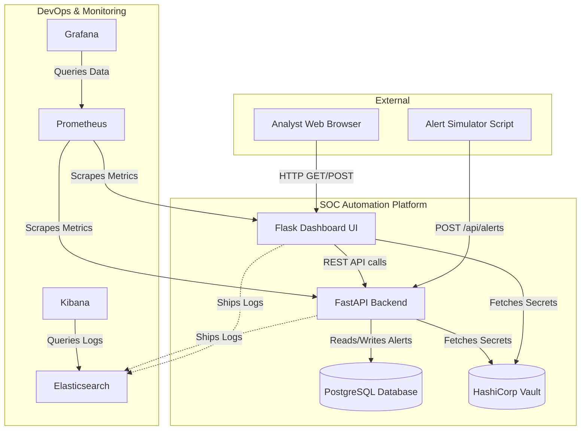

# Architecture Diagram

This is the logical architecture of the SOC Automation Platform. It demonstrates how data flows between the microservices.

```mermaid
flowchart TD
    subgraph External
        A[Analyst Web Browser]
        S[Alert Simulator Script]
    end

    subgraph "SOC Automation Platform"
        UI[Flask Dashboard UI]
        API[FastAPI Backend]
        DB[(PostgreSQL Database)]
        V[(HashiCorp Vault)]
    end

    subgraph DevOps & Monitoring
        P[Prometheus]
        G[Grafana]
        E[Elasticsearch]
        K[Kibana]
    end

    A -- HTTP GET/POST --> UI
    UI -- REST API calls --> API
    S -- "POST /api/alerts" --> API
    
    API -- Reads/Writes Alerts --> DB
    API -- Fetches Secrets --> V
    UI -- Fetches Secrets --> V

    P -- Scrapes Metrics --> API
    P -- Scrapes Metrics --> UI
    G -- Queries Data --> P
    
    API -. Ships Logs .-> E
    UI -. Ships Logs .-> E
    K -- Queries Logs --> E
```
