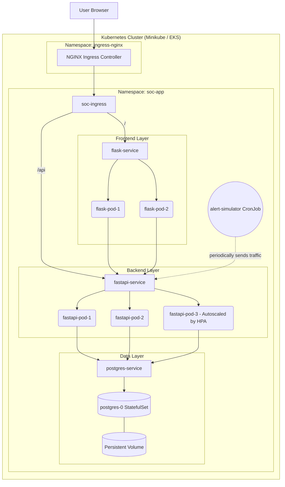

# Deployment Diagram

This diagram shows how the system is physically deployed into a Kubernetes cluster.

```mermaid
graph TD
    subgraph "Kubernetes Cluster (Minikube / EKS)"
        
        subgraph "Namespace: ingress-nginx"
            IngressController[NGINX Ingress Controller]
        end

        subgraph "Namespace: soc-app"
            Ingress[soc-ingress]
            
            subgraph "Frontend Layer"
                F_SVC[flask-service]
                F_POD1(flask-pod-1)
                F_POD2(flask-pod-2)
            end
            
            subgraph "Backend Layer"
                B_SVC[fastapi-service]
                B_POD1(fastapi-pod-1)
                B_POD2(fastapi-pod-2)
                B_POD3(fastapi-pod-3 - Autoscaled by HPA)
            end
            
            subgraph "Data Layer"
                DB_SVC[postgres-service]
                DB_STS[(postgres-0 StatefulSet)]
                PVC[(Persistent Volume)]
            end

            SIM((alert-simulator CronJob))
        end

        IngressController --> Ingress
        Ingress -- "/" --> F_SVC
        Ingress -- "/api" --> B_SVC

        F_SVC --> F_POD1
        F_SVC --> F_POD2

        B_SVC --> B_POD1
        B_SVC --> B_POD2
        B_SVC --> B_POD3

        F_POD1 --> B_SVC
        F_POD2 --> B_SVC

        B_POD1 --> DB_SVC
        B_POD2 --> DB_SVC
        B_POD3 --> DB_SVC

        DB_SVC --> DB_STS
        DB_STS --- PVC
        
        SIM -. periodically sends traffic .-> B_SVC
    end

    Client[User Browser] --> IngressController
```
